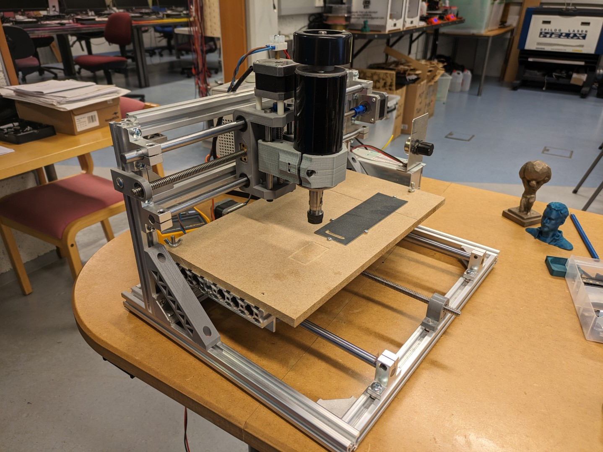
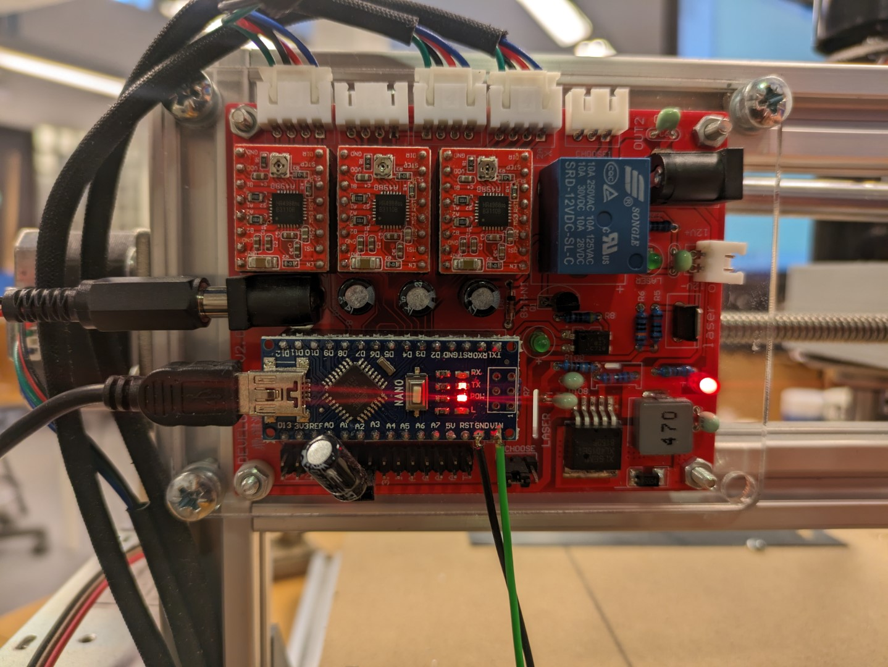
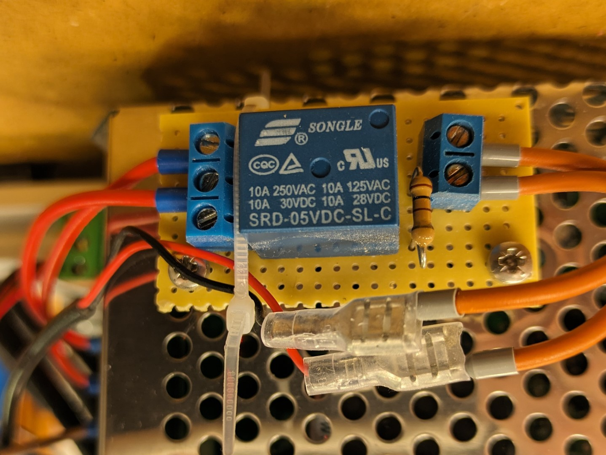
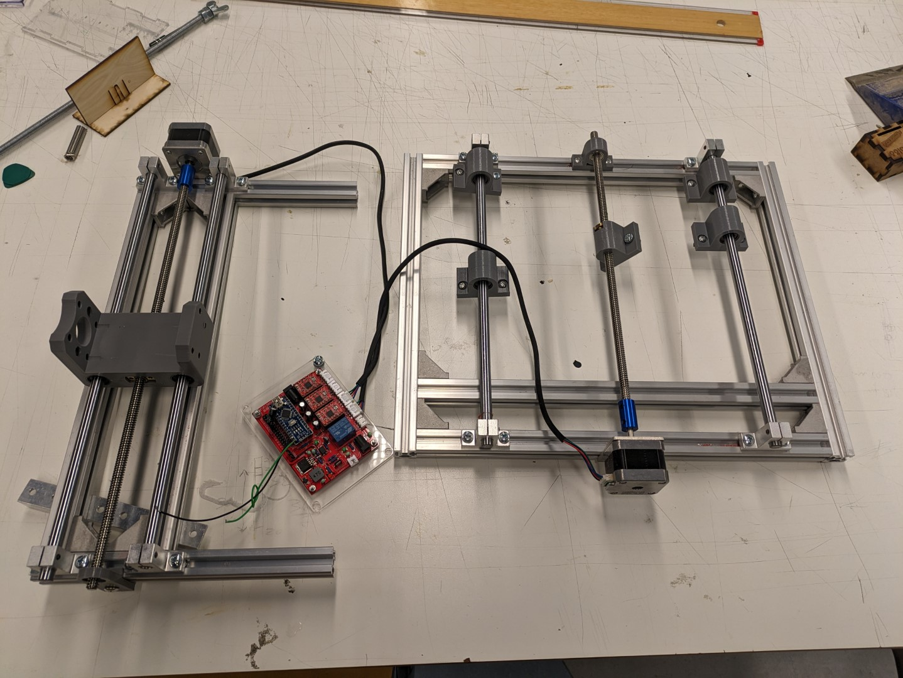
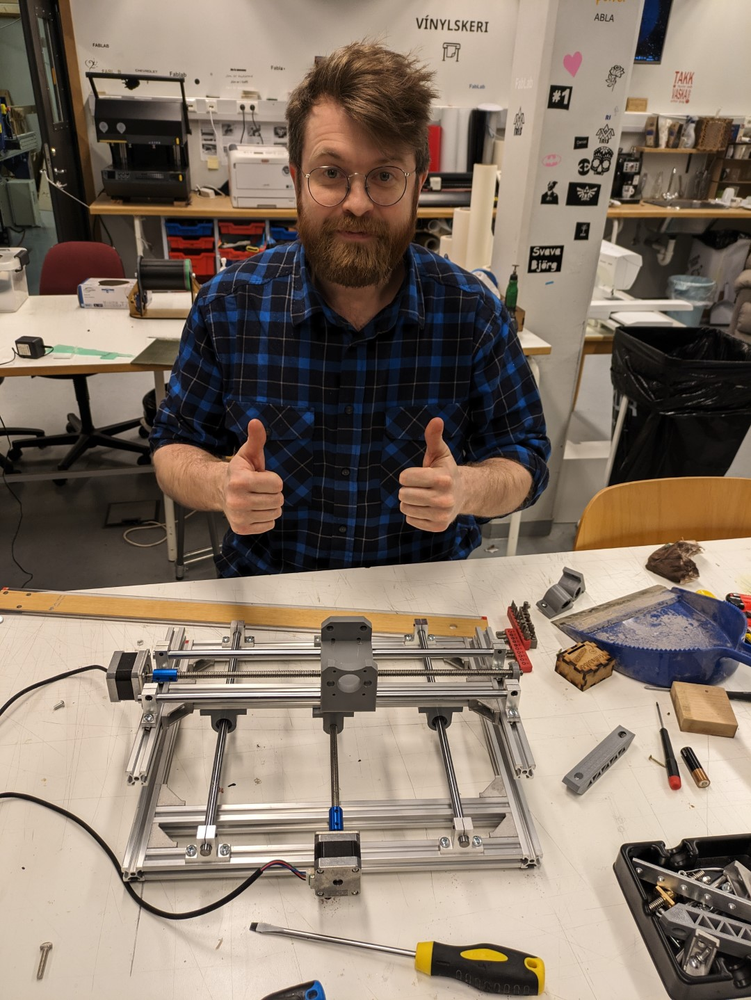

# Dunelicious

Dunelicious - Gömlum CNC breytt í sandborð

**Verk í vinnslu**

## Lýsing

Fab Lab Akureyri fékk gefins gamlan CNC fræs.

Markmiðið er að breyta honum í "[sandborð](https://www.youtube.com/watch?v=D8uCUroAHD4)".

## Punktar

- ~~Firmware var 0.9, uppfæra í1.1 (https://github.com/gnea/grbl/wiki/Compiling-Grbl)~~
- Vantar mögulega nýtt relay/staumbreyti fyrir borðið, virkar með power supply. (Kominn með nýtt, prófa að skipta því út).
- Bæta við Limit switches: https://github.com/gnea/grbl/wiki/Wiring-Limit-Switches
- ~~Breyta rammanum, fjarlægja spindilinn~~
- ~~Redda RPI (3 B+)~~
- https://learn.adafruit.com/read-only-raspberry-pi/overview < Þegar allt er tilbúið
- https://www.youtube.com/watch?v=hphhOyAHsHk
- https://github.com/gnea/grbl/wiki/Using-Grbl#python-streaming-scripts-officially-supported-by-grbl-cross-platform

## Ferlið

### Janúar 2024

Ákveðið að gera sandborðið, fræsinn skoðaður og prófaður. 

Kom í ljós að líklega er SRD-05VDC-SL-C bilað. Fékk annað, á eftir að skipta því út eða nota annað PSU. 

Með öðrum straumgjafa lifnaði brettið við og það prófað með G-kóða forritum á borð við LaserGRBL til að senda skjöl og skipanir. Þurfti að uppfæra firmware á Arduino Nano (GRBL 0.9 -> 1.1), eftir það virkaði það. 

Tókum fræsinn í sundur og röðuðum saman í einfaldari X/Y uppsetningu. 

